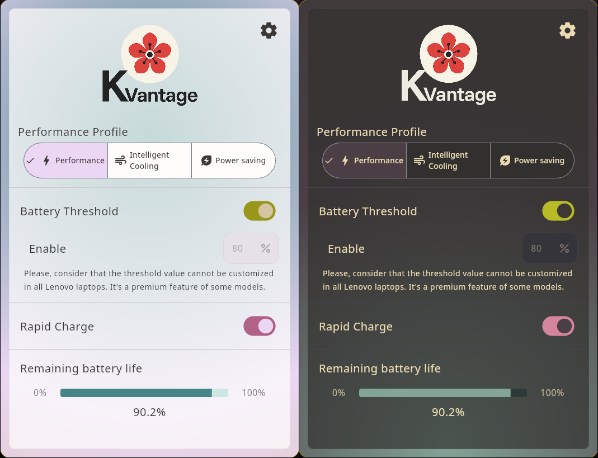
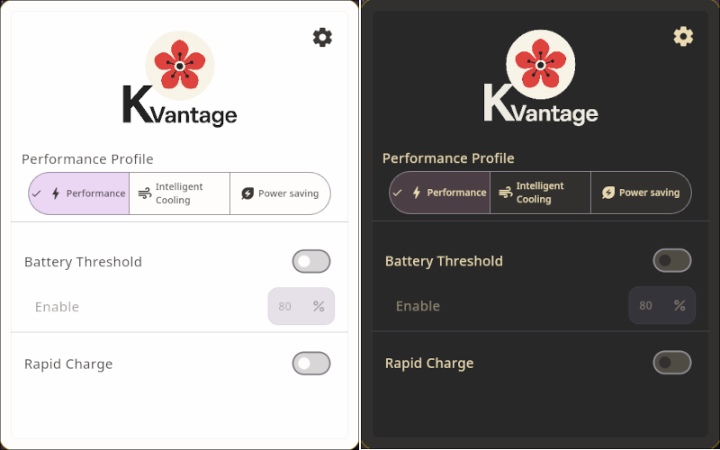
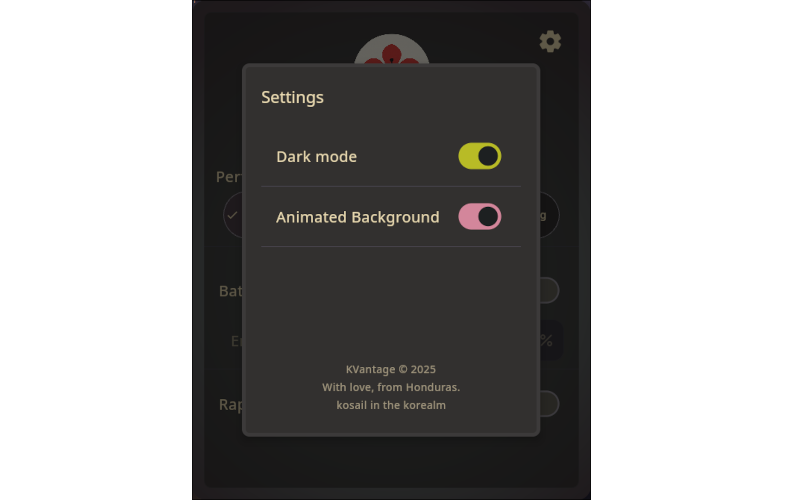

# KVantage
### Minimal control center for Lenovo laptops on Linux, inspired by GTK and macOS aesthetics.

**KVantage** is a sleek and minimal desktop app designed to provide users of Lenovo laptops running Linux with easy access to essential device settings. Inspired by the clean aesthetics of **GNOME (GTK)** and **macOS**, KVantage is built with **Kotlin + Compose Multiplatform for Desktop**, and aims to offer just the core features users care about. No bloat.

---

## 🚀 Current Status
#### Development Stage:
The graphical interface is already completed at 100%, but the backend that make the actual changes is not.
  
At first I thought of using the wonderful project [batmanager, by LevitatingBusinessMan](https://github.com/LevitatingBusinessMan/batmanager) which is exactly what this program aims for, but in CLI format. However, I couldn't make it work on NixOS (dynamic linking executable issues), and it is my main Linux distro.  
At the end, I decided to reimplement [LevitatingBusinessMan's](https://github.com/LevitatingBusinessMan) batmanager project but in Kotlin Native. More about this in another section below.
  
But going back to the main topic, the current status:
- **Functionality:** The GUI allows toggling performance profiles, battery thresholds, and rapid charge settings. System-level integration is being tested on Lenovo devices.
- **Usability:** Designed to be intuitive, light, and visually appealing, following minimal principles and Gruvbox theming. More themes may be implemented in the future.
- **Known Limitations:** System compatibility is limited to Lenovo laptops that expose firmware interfaces via `/sys`, `acpi`, or `ideapad-laptop` kernel module. Some features may require root permissions or external CLI tools.

---

## 🎯 Features (Planned & Implemented)
    Note:
        ⚠️  Means partially implemented.
        See next section below for more information.

⚠️ **Toggle Performance Profiles** (e.g., Powersave, Performance, Intelligent Cooling)  
⚠️ **Battery Charge Threshold Management**  (AKA limit battery charge at 80% to improve battery lifespan)  
⚠️ **Rapid Charge Enable/Disable**  
✅ **Dark and Light Themes with Gruvbox Palette**  
❌ **System Detection for Compatibility**  
❌ **Native image packaging** (Planned)

  
More images over here:

---
##  Backend
The backend component of KVantage is a native daemon named `kbatd`, written in Kotlin Native specifically for Linux systems (it relies on the platform.posix package). Its purpose is to provide a secure and efficient way to interact with Lenovo-specific ACPI interfaces exposed through `/proc/acpi/call`.

    As you may already know, these interfaces allow reading and
    writing settings such as battery conservation mode,
    rapid charging, and performance profiles,
    but they require root privileges to access.

The daemon runs as a long-lived background process launched once at application startup. I decided to do it in this way. This is because otherwise and working as a CLI tool like batmanager, it would require asking for user's password at startup and at every action related to the battery or performance options. Even though CLI tools are great, they are not as intuitive or attractive for standard users or new linux users. This daemon would be a better fit, asking for the user's password at the startup of the program, and having it as a service executed until the GUI is closed. 

But going back to the daemon thing. It is responsible for receiving commands from the graphical interface via standard input (stdin), executing the appropriate system-level actions, and returning results through standard output (stdout). This model avoids running the full GUI application with elevated privileges, which is considered unsafe and bad practice. Instead, only the minimal backend runs as root, reducing attack surface and improving system integrity.

At launch, `kbatd` (the daemon) checks whether it is running with root permissions. If it is not, it will attempt to re-execute itself using `pkexec`, prompting the user for their password through a standard system authentication dialog. This ensures that the daemon has the necessary permissions without forcing the entire application to start or run with escalated privileges.

The communication between the GUI and the daemon uses a simple, CLI-style text protocol such as `get-conservation` or `set-performance 2` (inspired by batmanager), making the interaction lightweight, debuggable, and secure. This also allows the daemon to validate all commands internally, ignoring anything unexpected or malformed and improving the security a little bit.

To keep things easy, I will maintain only the GUI app here, and kbatd daemon in another repository. In this repo you'll only find the native kbatd executable compiled. To see kbatd source code, please check the [daemon's repository here at my GitHub profile](https://github.com/kosail/kbatd).

---

## 🤝 Contributing
Contributions are welcome! Feel free to fork the repository and submit pull requests. If you have ideas, suggestions, or bug reports, open an issue on GitHub.

[//]: # (## 🎒 Resources)

## 📜 License

[GPLv3 (GNU General Public License v3)](LICENSE.txt) – Free to use, modify, and distribute as long as this remains open source, and it is not use for profitable purposes.

    GPLv3 Logos:
    Copyright © 2012 Christian Cadena
    Available under the Creative Commons Attribution 3.0 Unported License.

---
> **Note:** KVantage is a personal learning project and is not affiliated with Lenovo or any other brand or product.
---
KVantage Copyright © 2025, kosail 
 
With love, from Honduras.