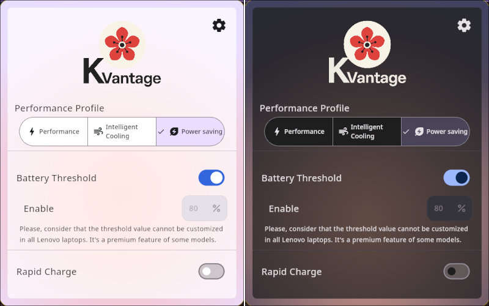
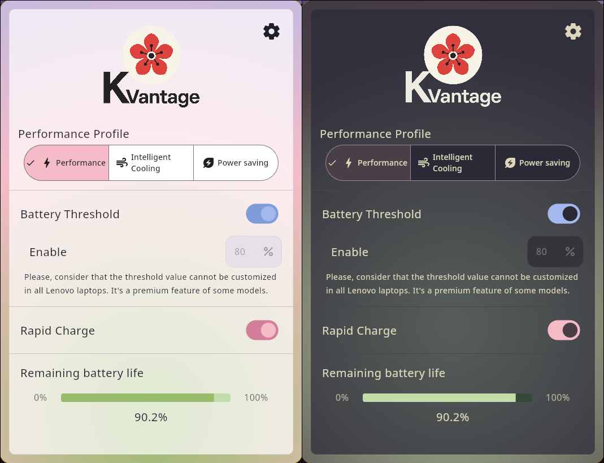
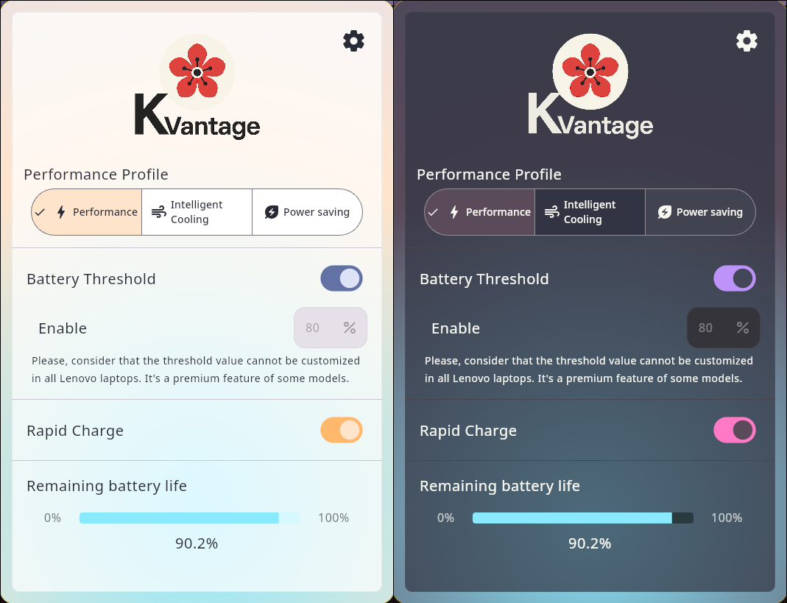

# 🌸 KVantage
### Minimal control center for Lenovo laptops on Linux, inspired by GTK and macOS aesthetics.

**KVantage** is a sleek and minimal desktop app designed to provide users of Lenovo laptops running Linux with easy access to essential device settings. Inspired by the clean aesthetics of **GNOME (GTK)** and **macOS**, KVantage is built with **Kotlin + Compose Multiplatform for Desktop**, and aims to offer just the core features users care about. No bloat.

---

## 🌻 Current Status
- **Development Stage**: The GUI and the backend are completed at 100%. The only function that is not yet implemented is the option to set a customized battery threshold. By now, it is hardcoded to the default value (which is 80%).
- **Functionality:** The GUI allows toggling performance profiles, battery thresholds, and rapid charge settings.
- **Usability:** Designed to be intuitive, light, and visually appealing. It has 4 available themes to choose from on settings.
- **Known Limitations:**
  1. System compatibility is limited to Lenovo laptops that expose the ACPI interface using the acpi_call kernel module (`/proc/acpi/call`).
  2. The app needs root access to perform the ACPI read and writes at `/proc/acpi/call`. This is a limitation that cannot be bypassed, but it was minimized by asking for the password once for the entire execution of the program, and isolating that mentioned root access to just the backend server.

### **Known bugs:**
* I just found that there is an issue of synchronization between the GUI and the backend, and even though they work together seamlessly, either the GUI or the backend are too fast for the other. I have to work on this.

---

## 🌹 Features (Planned & Implemented)

> **Note:** ⚠️  Means partially implemented.

✅ **Toggle Performance Profiles** (e.g., Powersave, Performance, Intelligent Cooling)  
✅ **Battery Charge Threshold Management**  (AKA limit battery charge at 80% to improve battery lifespan)  
✅ **Rapid Charge Enable/Disable**  
✅ **Multiple dark and light themes (by now only gruvbox is supported)**   
❌ **Settings persistance (by now settings are only store at runtime)**  
❌ **Custom threshold for battery conservation**  
❌ **Tray icon support**  
❌ **Native image packaging** (Planned)

---
##  🪻 Themes
All themes have their animated and plain color background. However, I will only post screenshots of each theme with the animated background. The only exception will be Gruvbox, as it is the default colorscheme.

### Gruvbox Theme (Default theme)

  
More images over here:

### Gruvbox Theme (Animated theme disabled)

### Material You Theme

### Kanagawa Theme

### Dracula Theme

[//]: # (![Settings]&#40;repo_images/gruvbox_theme_3.png&#41;)

---
##  🪷 Backend
At first, I thought of using the wonderful project [batmanager, by LevitatingBusinessMan](https://github.com/LevitatingBusinessMan/batmanager) which is exactly what this program aims for, but in CLI format. However, I know no Rust. I couldn't make it work on NixOS (dynamic linking executable issues), and it is my main Linux distro.  
At the end, due some limitations of the JVM and Kotlin Native, I decided to reimplement batmanager in Golang. More about this in the [backend section below](#backend).

To keep things clean, I will maintain only the GUI app here, and kvand (the backend daemon) in another repository. In this repo you'll only find the native kvand executable. To see kvand source code, comments and notes about it, please check the [daemon's repository here at my GitHub profile](https://github.com/kosail/Kvand).

---

## 💐 Contributing
Contributions are welcome! Feel free to fork the repository and submit pull requests. If you have ideas, suggestions, or bug reports, open an issue on GitHub.

[//]: # (## 🎒 Resources)

## 📜 License

[GPLv3 (GNU General Public License v3)](LICENSE.txt) – Free to use, modify, and distribute as long as this remains open source, and it is not use for profitable purposes.

    GPLv3 Logos:
    Copyright © 2012 Christian Cadena
    Available under the Creative Commons Attribution 3.0 Unported License.

---
> **Note:** KVantage is a personal learning project and is not affiliated with Lenovo or any other brand or product.
---
KVantage Copyright © 2025, kosail 
 
With love, from Honduras.
