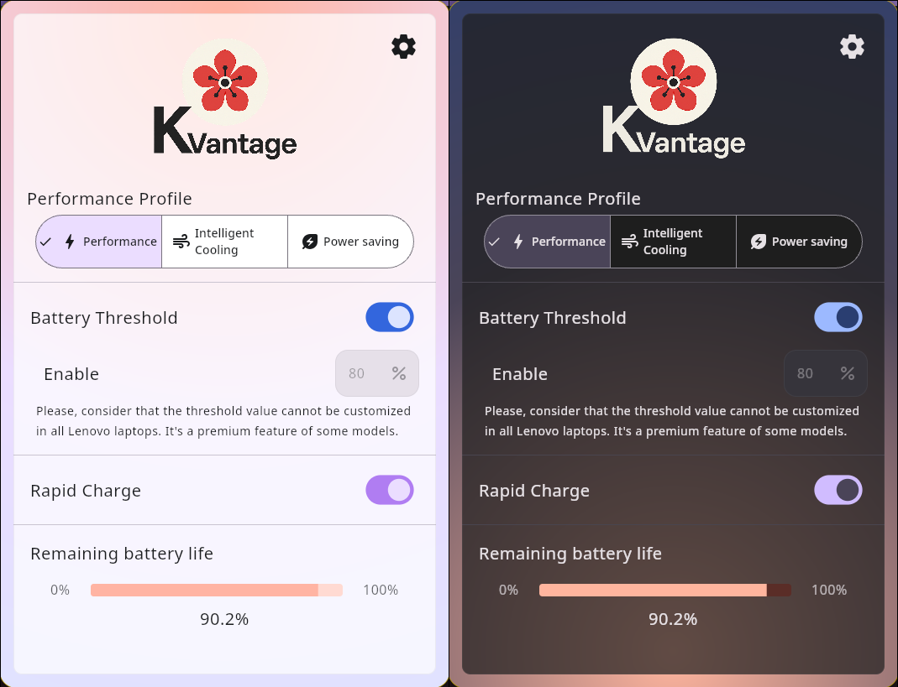

# 🌸 KVantage
### Minimal control center for Lenovo laptops on Linux, inspired by GTK and macOS aesthetics.

**KVantage** is a sleek and minimal desktop app designed to provide users of **Lenovo laptops** running Linux with easy access to essential device settings. Inspired by the clean aesthetics of **GNOME (GTK)** and **macOS**, KVantage is built with **Kotlin + Compose Multiplatform for Desktop**, and aims to offer just the core features users care about. No bloat.

---

## 🌻 Current Status
The app is fully functional. The only thing that is not yet implemented is the option to set a customized battery threshold. By now, it is hardcoded to the default value (which is 80%).

The GUI allows toggling performance profiles, battery thresholds, and rapid charge settings. Designed to be intuitive, light, and visually appealing. It has four available themes to choose from on settings, and supports up to three languages (Spanish, English and Japanese). It should change language based on your System's locale.
    

### **Known Limitations:**
  1. **System compatibility is limited to Lenovo laptops** that expose the ACPI interface using the acpi_call kernel module (`/proc/acpi/call`).
  2. The app needs root access to perform the ACPI read and writes at `/proc/acpi/call`. This is a limitation that cannot be bypassed, but it was minimized by asking for the password once for the entire execution of the program, and isolating that mentioned root access to just the backend server.

[//]: # (### **Known bugs:**)
[//]: # (* **No bugs found so far.**)

---

## 🌹 Features (Planned & Implemented)

> **Note:** ⚠️  Means partially implemented.

✅ **Toggle Performance Profiles** (e.g., Powersave, Performance, Intelligent Cooling)  
✅ **Battery Charge Threshold Management**  (AKA limit battery charge at 80% to improve battery lifespan)  
✅ **Rapid Charge Enable/Disable**  
✅ **Multiple dark and light themes (by now only gruvbox is supported)**   
✅ **Settings persistance (by now settings are only store at runtime)**  
❌ **Custom threshold for battery conservation**  
❌ **Native image packaging** (Planned. I'm not sure if it would be possible to create a .deb / .rpm or .appimage with a JAR file. Though, it was not possible to convert the JAR file into a native executable using GraalVM... so it has to be a JAR)

### Dropped planned functionalities (and why):
❌ **Tray icon support**: Sadly, KMP built-in tray support is poor on linux. I tried with KDE, Cinnamon and Hyprland but neither of them was recognized by the isTraySupported function, and it just refused to launch.

I tried alternatives like [ComposeNativeTray](https://github.com/kdroidFilter/ComposeNativeTray), but for some reason, the main action kills the app instead of toggling its visibility. I first thought it was a bug of my code, but after several hours of trial and error and having long discussions with AI, I couldn't figure out what's wrong. I desisted to use it.

Swing's system tray may work, but it looks horrid and I think it might cause more damage than adding value. And, the last resource I thought of libayatana-appindicator, and that's what I'm looking into. I'll probably just drop this feature though...

---
##  🪻 Themes
All themes have their animated and plain color background. However, I will only post screenshots of each theme with the animated background. The only exception will be Gruvbox, as it is the default colorscheme.

### Gruvbox Theme (Default theme)

  
More images over here:

### Gruvbox Theme (Animated theme disabled)

### Material You Theme

### Kanagawa Theme

### Dracula Theme

[//]: # (![Settings]&#40;repo_images/gruvbox_theme_3.png&#41;)

---
##  🪷 Backend
At first, I thought of using the wonderful project [batmanager, by LevitatingBusinessMan](https://github.com/LevitatingBusinessMan/batmanager) which is exactly what this program aims for, but in CLI format. However, I know no Rust. I couldn't make it work on NixOS (dynamic linking executable issues), and it is my main Linux distro.  
At the end, due some limitations of the JVM and Kotlin Native, I decided to reimplement batmanager in Golang. More about this in the [backend section below](#backend).

To keep things clean, I will maintain only the GUI app here, and kvand (the backend daemon) in another repository. In this repo you'll only find the native kvand executable. To see kvand source code, comments and notes about it, please check the [daemon's repository here at my GitHub profile](https://github.com/kosail/Kvand).

---

## 💐 Contributing
Contributions are welcome! Feel free to fork the repository and submit pull requests. If you have ideas, suggestions, or bug reports, open an issue on GitHub.

---

## 🎒 What I learned from this project

Bro, I need to use loggers to keep track of what's happening with the app in all moment. It was HARD to follow the execution and debug, and moreover, due to the fact this app was tested running as root.

I know, I played with fire. Sorry mom, I will not do that again. I will test my apps without root privileges from now on.

---

## 📜 Disclaimer & License
This app targets specifically Lenovo laptops. Please do NOT run it if your laptop is not Lenovo. The backend assumes it is run on a Lenovo laptop with a known/defined ACPI table to access the battery, performance and rapid charge.
This software needs root privileges to run, and thus, expect undefined behavior if you run Lenovo specific ACPI commands in a non-targeted ACPI table. Use it as your own risk.

[GPLv3 (GNU General Public License v3)](LICENSE.txt) – Free to use, modify, and distribute as long as this remains open source, and it is not use for profitable purposes.

GPLv3 Logos:

    Copyright © 2012 Christian Cadena
    Available under the Creative Commons Attribution 3.0 Unported License.

---
> **Note:** KVantage is a personal learning project and is not affiliated with Lenovo or any other brand or product.
---
KVantage Copyright © 2025, kosail 
 
With love, from Honduras.
